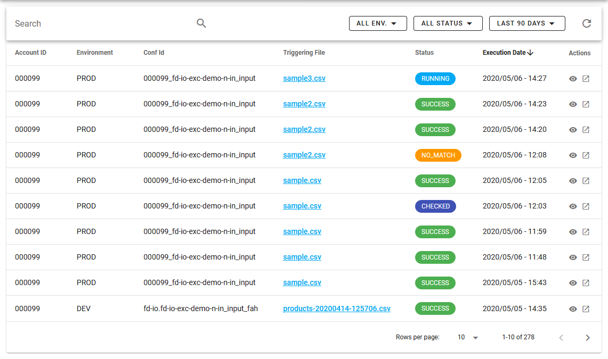

# Monitor data operations' status

## 🚥 Status information available

Tailer Studio allows you to monitor the status of the data operations you have deployed with Tailer Platform and of each of their executions.

### **Possible status for data operations**

A data operation can have the following status:

* **Activated**: The data operation was successfully deployed and is now processing data. Note that the deployment can take a couple minutes to complete, even if the status is already **Activated**. You can click on the status to toggle it to **Disabled**.
* **Disabled**: The data operation was disabled. You can click on the status to toggle it back to **Activated**.
* **Not set**: The first deployment of the data operation was initialized incorrectly, and it cannot be used as is. In this case, you need to update its configuration, and deploy it again.

### **Possible status for data operation executions**

Each execution of a data operation can have the following status:

* **Success**: The execution was successful.
* **Failed**: The execution failed.
* **Running**: The execution is still in progress.
* **No match**: A file was added to a repertory watched by a data operation, but it didn't match any filename template. This status allows you to check if new templates might be required.
* **Checked**: You can manually change the status of a **Failed** execution to **Checked** if you have fixed the issue.

## 🛂 Display or edit the status of a data operation/execution

To display/edit the status of a data operation/execution:

1. Log in to [Studio](https://jarvis-platform.io/sign-in?redirect=%2F&__hstc=57968821.199e85015347f5cf00c120e5932c4c81.1601276395705.1601469338939.1601472992239.17&__hssc=57968821.2.1601472992239&__hsfp=649433320).
2. In the left navigation panel, in the **Data pipeline** section, select the [type of your data operation](../data-pipeline-operations/untitled.md#types-of-data-pipeline-operations), \(for example, **Storage to Storage**\).
3. In the right panel, access the **Configurations** tab for data operations or the **Runs** tab for executions.
4. The list of all the deployed data operations/executions displays. You can see their status in the corresponding row. If necessary, click the status to edit it.

