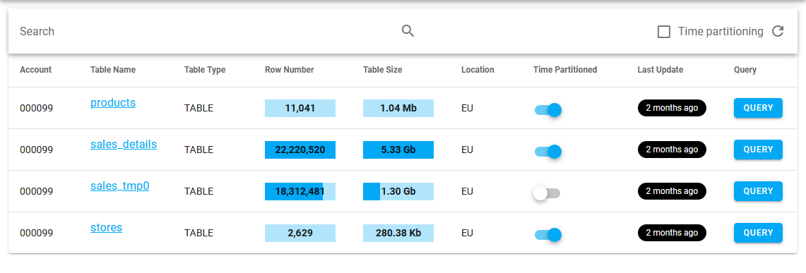
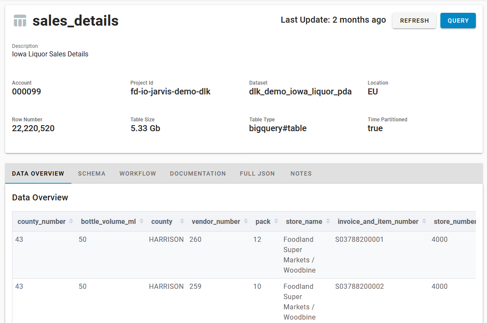

# View your data catalog

## 📚 Data catalog information

Tailer Studio allows you to display a number of information about the BigQuery tables obtained as a result of Tailer Platform data operations.

### **BigQuery table list**

Tailer Studio allows you to display the list of BigQuery tables created using Tailer Platform, sorted by dataset.

Table details, such as the type, number of rows, size, and location display on each row. The **Last Update** column color code allows you to see at a glance if your data catalog is up-to-date. Clicking the **Query** button takes you directly to the Google BigQuery's Web page where you can query the table.

**Table information**

Tailer Studio also provides detailed information about each table. The **Query** button that takes you to Google BigQuery is available on this screen as well.

The following information is available:

* **Data Overview**: The first 10 rows of the table are displayed here to give you a preview of its contents \(unless the table contains sensitive information, in which case these are hidden\).
* **Schema**: Contents of the DDL file provided when creating the table.
* **Workflow**: Details about the data operation execution that last updated the table.
* **Documentation**: Contents of the Markdown file provided when creating the table.
* **Full JSON**: JSON configuration file of the data operation through which the table was created.
* **Notes**: Comments and answers can be added by users about the table in the form of conversations.

## 👀 View your data catalog

To view your data catalog:

1. Log in to [Tailer Studio](https://jarvis-platform.io/sign-in?redirect=%2F&__hstc=57968821.199e85015347f5cf00c120e5932c4c81.1601276395705.1601476688274.1601480246130.19&__hssc=57968821.4.1601480246130&__hsfp=649433320).
2. If necessary, select an account in the drop-down menu at the top of the screen.
3. In the left navigation panel, in the **Data catalog** section, select a Google Cloud Platform project.
4. Click the **Table name** link corresponding to the BigQuery table of your choice
5. Browse the different tabs to display the information that you want.

